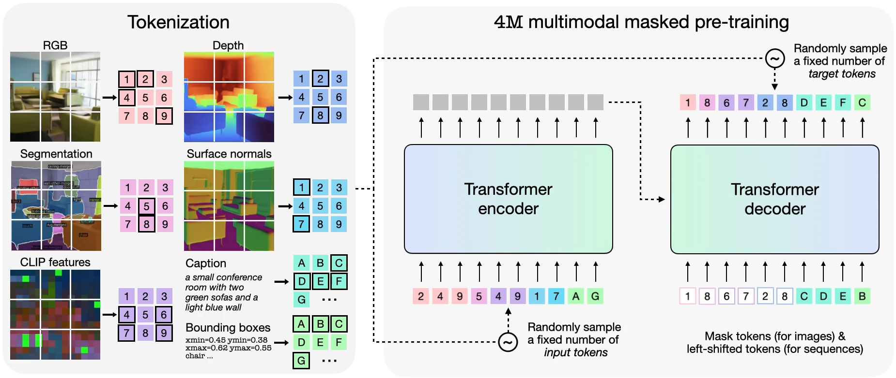

# COM-304: Communication Project. Foundation Model.

The goal of this project is to familiarize you with the essential building blocks that make up modern large language and multimodal models. 

To prepare you for this, we will distribute homeworks that teach you the basics of **[PyTorch](https://pytorch.org/)** and computing clusters like **[SCITAS](https://www.epfl.ch/research/facilities/scitas/)**, which will be used throughout this course. 
Additionally, you will explore the **4M multimodal foundation model**, gaining an understanding of its applications in **generation and retrieval tasks**.

The main part of the project will be about implementing `nano4M`, a minimal version of 4M, which will give you a practical understanding of how to design and train multimodal foundation models. In addition, you will implement a series of extensions of your choice on top of the nano4M codebase.

To ensure you grasp these concepts, we have designed exercises in the provided Jupyter notebooks. These exercises will help you verify your understanding as you progress through the materials.

## Schedule

- Week 1 to week 4: PyTorch tutorial, SCITAS setup, 4M tutorial
- Week 5 to week 9: Nano-4M project
- Week 10 to week 15: Nano-4M extension

## Notebooks
### 1. SCITAS
Follow the provided instructions at [SCITAS Tutorial](https://github.com/EPFL-VILAB/com-304-4M-project-dev/blob/main/SCITAS_Tutorial/scitas_tutorial.md#scitas-tutorial) to set up your **SCITAS environment**.

### 2. Homework 1: PyTorch [Worth 9% of your overall grade]
[PyTorch](https://pytorch.org/) is an **open-source deep learning framework**, which provides a flexible and intuitive way to build deep learning models.
In the [PyTorch_Tutorial](./PyTorch_Tutorial/) folder, you will find three tutorials covering the **basic usage of PyTorch** and the corresponding exercises. If you are already familiar with PyTorch, you can proceed directly to the exercises.

### 3. Homework 2: Multimodal Foundation Model (4M) [Worth 16% of your overall grade]
After gaining familiarity with PyTorch and SCITAS, you will explore the multimodal foundation model **[4M](https://4m.epfl.ch/)**. This hands-on experience will help you understand the model's key components and how to utilize its pipeline for generation and retrieval tasks.

To get started, follow the instructions in the [4M_Tutorial](./4M_Tutorial/) folder to learn more about the model, set up the required environment, and experiment with the provided Jupyter notebooks!

## `nano4M`

Please see [COM_304_Spring_2025_nano4M_Project_Guidelines.pdf](/COM_304_Spring_2025_nano4M_Project_Guidelines.pdf) for `nano4M` project guidelines (last updated 15.05.2025).
